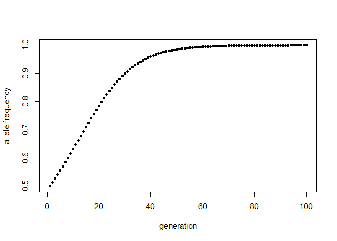
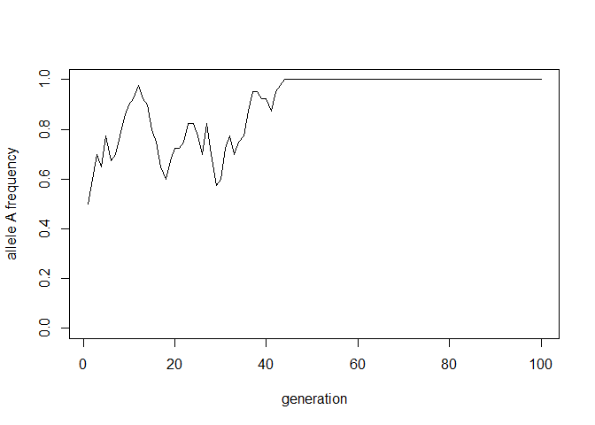
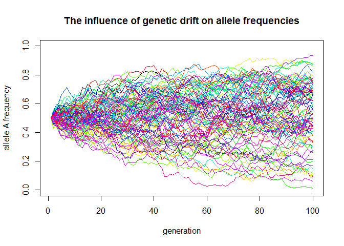
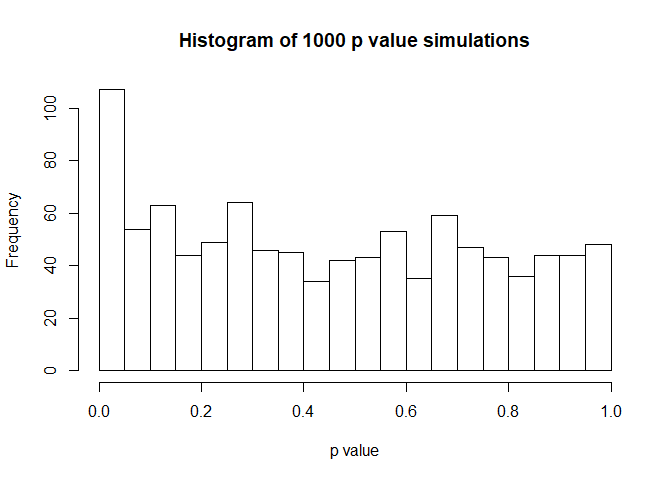
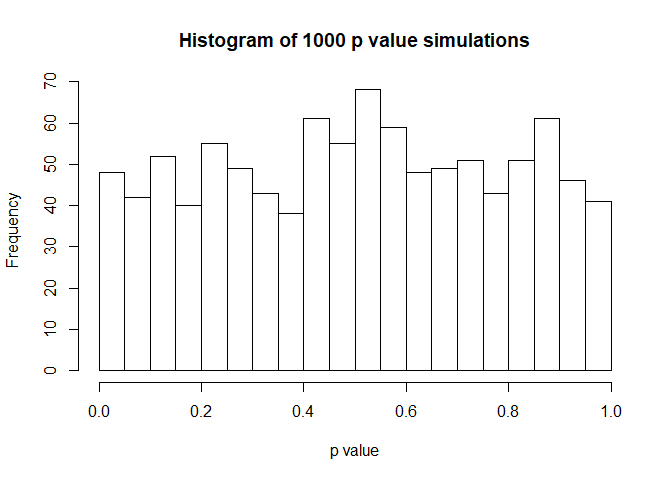
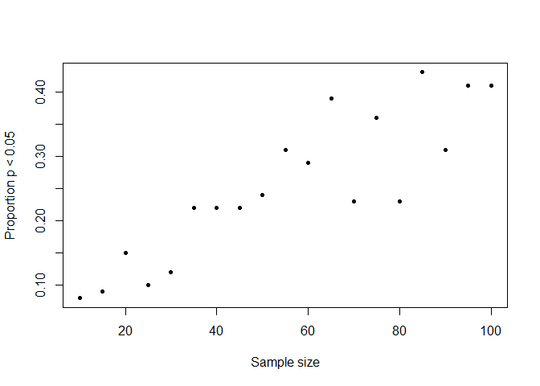

#1
Completed

#2

```r
diploid_selection <- function(p0, Wpp, Wpq, Wqq, n) {
  #Initialize vectors to store allele frequencies and mean pop fitness
  p <- rep(NA, n)
  q <- rep(NA, n)
  w_bar <- rep(NA, n)
  
  #starting conditions
  p[1] <- p0
  q[1] <- 1 - p0
 
  #for loop from generation to generation
  for (i in 2:n) {
    w_bar[i-1] <- (p[i-1]^2)*Wpp + 2*p[i-1]*q[i-1]*Wpq + (q[i-1]^2)*Wqq
    p[i] <- (p[i-1]^2)*(Wpp/w_bar[i-1]) + p[i-1]*q[i-1]*(Wpq/w_bar[i-1])
    q[i] <- (q[i-1]^2)*(Wqq/w_bar[i-1]) + p[i-1]*q[i-1]*(Wpq/w_bar[i-1])
  }
  print(p)
  if (any(p > 0.9999)) {
    fixation <- min(which.max(p > 0.9999))
    cat("fixation for p occurs approximately at generation:", fixation)
  } else {
    maxAlleleFreq <- max(p)
    cat("fixation of p does not occur, max allele frequency is:", maxAlleleFreq)
  }
  plot(x = 1:n, y = p, pch = 20, ylab = "allele frequency", xlab = "generation")
}
```

Example for starting frequency of allele "A" as 0.5, Wpp = 1, Wpq = 0.9, Wqq = 0.9 for 100 generations.

```r
diploid_selection(0.5, 1, 0.9, 0.9, 100)
```

```
##   [1] 0.5000000 0.5135135 0.5273616 0.5415289 0.5559962 0.5707404 0.5857343
##   [8] 0.6009464 0.6163412 0.6318790 0.6475164 0.6632064 0.6788991 0.6945420
##  [15] 0.7100813 0.7254620 0.7406293 0.7555293 0.7701101 0.7843225 0.7981212
##  [22] 0.8114652 0.8243187 0.8366515 0.8484394 0.8596639 0.8703130 0.8803802
##  [29] 0.8898649 0.8987715 0.9071089 0.9148902 0.9221321 0.9288541 0.9350777
##  [36] 0.9408266 0.9461252 0.9509989 0.9554733 0.9595740 0.9633261 0.9667541
##  [43] 0.9698818 0.9727318 0.9753259 0.9776845 0.9798271 0.9817715 0.9835349
##  [50] 0.9851329 0.9865800 0.9878897 0.9890744 0.9901456 0.9911136 0.9919880
##  [57] 0.9927777 0.9934906 0.9941339 0.9947143 0.9952379 0.9957100 0.9961357
##  [64] 0.9965194 0.9968653 0.9971770 0.9974579 0.9977109 0.9979389 0.9981442
##  [71] 0.9983292 0.9984958 0.9986458 0.9987809 0.9989025 0.9990121 0.9991107
##  [78] 0.9991995 0.9992794 0.9993514 0.9994162 0.9994745 0.9995270 0.9995742
##  [85] 0.9996168 0.9996551 0.9996896 0.9997206 0.9997485 0.9997736 0.9997963
##  [92] 0.9998166 0.9998350 0.9998515 0.9998663 0.9998797 0.9998917 0.9999025
##  [99] 0.9999123 0.9999211
## fixation for p occurs approximately at generation: 98
```

<!-- -->

#3

```r
Genetic_Drift_sim <- function(N, p, n) {
  #Initializing vectors for storing frequencies of "A" and "a"
  freq_A <- rep(NA, n)
  freq_a <- rep(NA, n)
  #Starting values, p is freq of "A", q is freq of "a"
  freq_A[1] <- p
  freq_a[1] <- 1 - p
  
  #for loop from generation to generation
  for (i in 2:n) {
    allele_counts <- sample(c("A", "a"), size = N, replace = TRUE, prob = c(freq_A[i-1], freq_a[i-1]))
    freq_A[i] <- mean(allele_counts == "A")
    freq_a[i] <- mean(allele_counts == "a")
  }
  plot(x = 1:n, y = freq_A, ylim = c(0, 1), type = "l", ylab = "allele A frequency", xlab = "generation")
}
```

Example using starting allele population size of N = 40, frequency of "A" of p = 0.5, and number of generations of n = 100.

```r
Genetic_Drift_sim(40, 0.5, 100)
```

<!-- -->

#4
Slightly modifying the output of the function from question 3 to give a Boolean value.

```r
Genetic_Drift_sim_lost <- function(N, p, n) {
  #Initializing vectors for storing frequencies of "A" and "a"
  freq_A <- rep(NA, n)
  freq_a <- rep(NA, n)
  #Starting values, p is freq of "A", q is freq of "a"
  freq_A[1] <- p
  freq_a[1] <- 1 - p
  
  #for loop from generation to generation
  for (i in 2:n) {
    allele_counts <- sample(c("A", "a"), size = N, replace = TRUE, prob = c(freq_A[i-1], freq_a[i-1]))
    freq_A[i] <- mean(allele_counts == "A")
    freq_a[i] <- mean(allele_counts == "a")
  }
  return(any(freq_A == 0))
}
```

Creating a function to repeat the above function x times:

```r
Proportion_Lost <- function(x, N, p, n) {
  Bool_lost <- replicate(x, Genetic_Drift_sim_lost(N, p, n))
  return(mean(Bool_lost))
}
```

Answering the question:

```r
Proportion_Lost(1000, 400, 0.5, 100)
```

```
## [1] 0.004
```

```r
Proportion_Lost(1000, 400, 0.25, 100)
```

```
## [1] 0.106
```

```r
Proportion_Lost(1000, 400, 0.1, 100)
```

```
## [1] 0.408
```

#5
Again modifying the output of the previous genetic drift sim function:

```r
#Function accepts 'N', the number of alleles in the population, 'p', the frequency of allele "A" in the population, and 'n', the desired number of generations.
Genetic_Drift_sim_plot <- function(N, p, n) {
  #Initializing vectors for storing frequencies of "A" and "a"
  freq_A <- rep(NA, n)
  freq_a <- rep(NA, n)
  #Starting values, p is freq of "A", q is freq of "a"
  freq_A[1] <- p
  freq_a[1] <- 1 - p
  
  #for loop from generation to generation
  for (i in 2:n) {
    allele_counts <- sample(c("A", "a"), size = N, replace = TRUE, prob = c(freq_A[i-1], freq_a[i-1]))
    freq_A[i] <- mean(allele_counts == "A")
    freq_a[i] <- mean(allele_counts == "a")
  }
  return(freq_A)
}
```

Writing a new function to plot x number of desired simulations:

```r
#Function accepts same 'N', 'p', 'n' variables as above, as well as variable 'x' denoting the desired number of simulations.
Freq_plot <- function(x, N, p, n) {
  plot(x = 1:n, y = Genetic_Drift_sim_plot(N, p, n), ylim = c(0, 1), type = "l", ylab = "allele A frequency", xlab = "generation", main = "The influence of genetic drift on allele frequencies")
  col_gen <- rainbow(x-1)
  for (i in 1:x-1) {
    lines(x = 1:n, y = Genetic_Drift_sim_plot(N, p, n), col = col_gen[i])
  }
}
```

Testing with 100 simulations for 200 diploid individuals, 100 generations, starting frequency p = 0.5:

```r
Freq_plot(100, 400, 0.5, 100)
```

<!-- -->

#6

```r
p_value <- function(a, b, n, s) {
  x <- seq(from = 1, to = 10, length.out = n)
  y_deterministic <- a + b*x
  y_simulated <- rnorm(length(x), mean = y_deterministic, sd = s)
  mod_sim <- lm(y_simulated ~ x)
  p_val_slope <- summary(mod_sim)$coef[2,4]
  return(p_val_slope)
}
```

You can set the seed for the random number generator equal to the same amount before testing this stochastic function and the code you wrote, and the result is the same.


```r
set.seed(720)
p_value(0.5, 0.1, 20, 2)
```

```
## [1] 0.3620625
```

Running the function 1000 times and determining the proportion of p values less than 0.05:

```r
p_value_1000 <- replicate(1000, p_value(0.5, 0.1, 20, 2))
hist(p_value_1000, breaks = 20, xlab = "p value", main = "Histogram of 1000 p value simulations")
```

<!-- -->

```r
mean(p_value_1000 < 0.05)
```

```
## [1] 0.107
```

Re-running the above but with slope equal to 0:

```r
p_value_1000_slope0 <- replicate(1000, p_value(0.5, 0, 20, 2))
hist(p_value_1000_slope0, breaks = 20, xlab = "p value", main = "Histogram of 1000 p value simulations")
```

<!-- -->

```r
mean(p_value_1000_slope0 < 0.05)
```

```
## [1] 0.048
```

When the slope is 0 the proportion of p values less than 0.05 hovers around 0.05. The rnorm function is now generating numbers from a distribution with a fixed mean (0.5 in this case). Any p values less than 0.05 is purely by chance.

For the last part:

```r
by5seq <- seq(10, 100, by = 5)
by5p <- rep(NA, length(by5seq))
for (i in 1:length(by5seq)) {
  by5p[i] <- mean(replicate(100, p_value(0.5, 0.1, by5seq[i], 1.5)) < 0.05)
}
plot(x = by5seq, y = by5p, xlab = "Sample size", ylab = "Proportion p < 0.05", pch = 20)
```

<!-- -->

Evidently as sample size increases, so does the proportion of p values less than 0.05. This makes sense as increasing sample size increases the confidence of the result.

