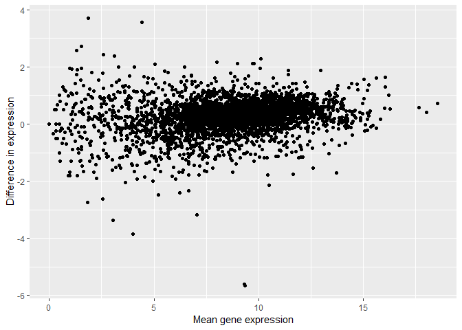

**2.**

```r
rna_counts <- read.csv(file="C:\\Users\\jason\\Downloads\\eXpress_dm_counts.csv", row.names = 1)
#function for mean expression data of columns
colmean_expression <- function(x, y, use_log2 = FALSE) {
  if (use_log2 == TRUE) {
    #returns mean of the log2 of column values, ignoring zeroes that would cause the returned value to be -INF
    return(mean(log2(x[[y]][x[[y]] != 0])))
  } else {
    mean(x[[y]])
  }
}
```

Testing for column 2:

```r
colmean_expression(rna_counts, 2)
```

```
## [1] 1983.25
```

```r
colmean_expression(rna_counts, 2, use_log2 = TRUE)
```

```
## [1] 9.045379
```
**3.**

```r
colmean_vector <- vector(mode = "double", length = length(rna_counts))
names(colmean_vector) <- colnames(rna_counts)
for (i in 1:length(rna_counts)) {
  colmean_vector[i] <- colmean_expression(rna_counts, i)
}
head(colmean_vector)
```

```
##  F101_lg_female_hdhorn F101_lg_female_thxhorn   F101_lg_female_wings 
##               1978.847               1983.250               1583.904 
##  F105_lg_female_hdhorn F105_lg_female_thxhorn   F105_lg_female_wings 
##               2105.712               1433.749               1869.962
```
**4.**

```r
colmean_vector2 <- vapply(rna_counts, mean, FUN.VALUE = double(1))
head(colmean_vector2)
```

```
##  F101_lg_female_hdhorn F101_lg_female_thxhorn   F101_lg_female_wings 
##               1978.847               1983.250               1583.904 
##  F105_lg_female_hdhorn F105_lg_female_thxhorn   F105_lg_female_wings 
##               2105.712               1433.749               1869.962
```
Intuition suggests colmean_vector2 generation should be faster, but calling it and colmean_vector with system.time() simply results in zeroes so I am unable to make a conclusion on this machine.

**5.**

```r
colmean_vector3 <- colMeans(rna_counts)
head(colmean_vector3)
```

```
##  F101_lg_female_hdhorn F101_lg_female_thxhorn   F101_lg_female_wings 
##               1978.847               1983.250               1583.904 
##  F105_lg_female_hdhorn F105_lg_female_thxhorn   F105_lg_female_wings 
##               2105.712               1433.749               1869.962
```
**6.**

```r
rowmean_expression <- function(x, use_log2 = FALSE) {
  if (use_log2 == TRUE) {
    #Change zeroes to NA
    x[x == 0] <- NA
    #rowMeans returns NA for row mean if row contains nothing but NA (i.e. the expression values were all zeroes)
    return(rowMeans(log2(x), na.rm = TRUE))
  } else {
    rowMeans(x)
  }
}
meangene_expression <- rowmean_expression(rna_counts, use_log2 = TRUE)
head(meangene_expression)
```

```
## FBpp0087248 FBpp0293785 FBpp0080383 FBpp0077879 FBpp0311746 FBpp0289081 
##    4.320303   11.016324    6.202876    5.399504    7.083801   10.306870
```
**7.**

```r
# Subsets of rna_counts containing just data from sm and lg male hdhorn
rna_counts_sm_male_hdhorn <- rna_counts[grep("sm_male_hdhorn$", names(rna_counts))]
rna_counts_lg_male_hdhorn <- rna_counts[grep("lg_male_hdhorn$", names(rna_counts))]
rna_counts_male_hdhorn <- data.frame(rna_counts_lg_male_hdhorn, rna_counts_sm_male_hdhorn)
# Storing mean of gene expression values in vectors
meangene_expression_sm_male_hdhorn <- rowmean_expression(rna_counts_sm_male_hdhorn)
meangene_expression_lg_male_hdhorn <- rowmean_expression(rna_counts_lg_male_hdhorn)
meangene_expression_male_hdhorn <- rowmean_expression(rna_counts_male_hdhorn)
# Storing difference in mean gene expression between lg and sm in a vector
diff_expression_lg_sm_male_hdhorn <- meangene_expression_lg_male_hdhorn - meangene_expression_sm_male_hdhorn
# Showing that it works
head(diff_expression_lg_sm_male_hdhorn)
```

```
## FBpp0087248 FBpp0293785 FBpp0080383 FBpp0077879 FBpp0311746 FBpp0289081 
##      -16.25     3409.25       -5.75      -16.25       26.00      -19.50
```
**8.**

```r
library(ggplot2)
#Storing vectors from question 7 in a data frame
df_8 <- data.frame(meangene_expression_lg_male_hdhorn, meangene_expression_sm_male_hdhorn, meangene_expression_male_hdhorn, diff_expression_lg_sm_male_hdhorn)
# Plotting large-small difference in mean expression vs mean expression across both
ggplot(df_8, aes(x = meangene_expression_male_hdhorn, y = diff_expression_lg_sm_male_hdhorn)) + geom_point() + labs(x = "Mean gene expression", y = "Difference in expression")
```

<!-- -->

For log transformed.

```r
# Storing mean of log2 gene expression values in vectors
mean_log_gene_expression_sm_male_hdhorn <- rowmean_expression(rna_counts_sm_male_hdhorn, use_log2 = TRUE)
mean_log_gene_expression_lg_male_hdhorn <- rowmean_expression(rna_counts_lg_male_hdhorn, use_log2 = TRUE)
mean_log_gene_expression_male_hdhorn <- rowmean_expression(rna_counts_male_hdhorn, use_log2 = TRUE)
# Storing the difference of the mean log2 gene expression values for large and small male head horns in a vector
diff_log_expression_lg_sm_male_hdhorn <- mean_log_gene_expression_lg_male_hdhorn - mean_log_gene_expression_sm_male_hdhorn
# Storing the above four vectors in a single data frame
df_8_log <- data.frame(mean_log_gene_expression_lg_male_hdhorn, mean_log_gene_expression_sm_male_hdhorn, mean_log_gene_expression_male_hdhorn, diff_log_expression_lg_sm_male_hdhorn)
# Plotting large-small difference in mean log2 expression vs mean log2 expression across both
ggplot(df_8_log, aes(x = mean_log_gene_expression_male_hdhorn, y = diff_log_expression_lg_sm_male_hdhorn)) + geom_point() + labs(x = "Mean gene expression", y = "Difference in expression")
```

```
## Warning: Removed 18 rows containing missing values (geom_point).
```

<!-- -->

The 18 rows containing missing values results from the rowMeans function producing NA when all sample gene expression values from a particular tissue type are 0 and the rowmean_expression function is called. There are 9 instances of this in the subset of lg_male_hdhorn and 13 instances in the subset of sm_male_hdhorn. When the difference is taken between the two, the subtraction of NA from any value is NA. This results in the number of NA-containing rows for the vector of the difference in mean gene expression being the union of the two afformentioned subsets, in this case 18. This would be avoided if the strategy involving the addition of a small value, say 1, to all values in rna_counts to prevent zeroes were employed.

**BONUS**

One could conceivably use the dplyr package to filter the rna_counts data frame to pull out small and large male head horn columns (filter verb). Moreover, one could use the mutate verb to create new columns containing the mean expression of each gene and the difference in mean expression of each gene between large and small head horn samples.
