```r
library(ggplot2)
library(tidyr)
```

#Chapter 1
Data visualization combines statistics and design
Exploratory visualizations are data heavy and intended for small audience
Explanatory explains are more data specific and intended for broader audiences

By default variables are treated as continuous rather than categorical. Wrapping the variable name in factor() explicitly tells ggplot that the variable is categorical. 
*e.g.* 

```r
ggplot(mtcars, aes(x = factor(cyl), y = mpg)) + geom_point()
```

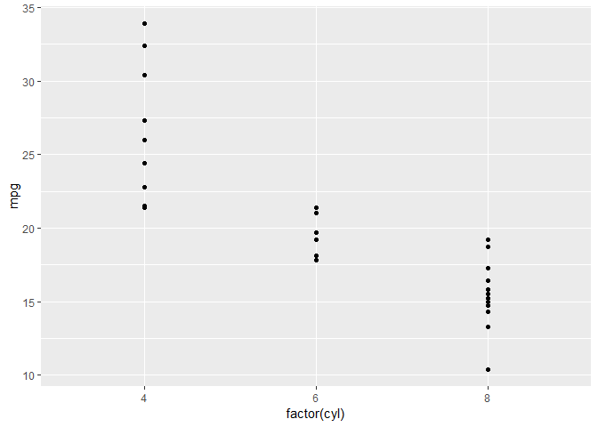<!-- -->

**Grammar of Graphics**

Graphics are distinct layers of grammatical elements (like sentence elements nouns or adjectives) Meaningful plots created though aesthetic mapping (rules to assembly data vocab). There are 7 grammatical elements, 3 are essential.

* Data - dataset being plotted
* Aesthetics - scales onto which data is mapped
* Geometries - Visual elements used for data
* 4 optional and control details of the plot: Facets, statistics, coordinates, and themes

*Aesthetics*

* Color arguments in aes() 
* Size argument in aes()

Both map the chosen variable onto the plot as a color gradient of continuous size scale.Shape argument is similar, but only is used for categorical data as the limited number of shapes makes no sense with continuous data.

ggplot 2  enables construction of plots in R by layering grammatical elements and defining visualizations with aesthetic mappings.

geom layer functions:

*geom_point() - tells ggplot to draw points on the plot, can add "alpha = x" to set transparency. 
*geom_smooth() - tells ggplot to draw a smoothed line over the points. "se = FALSE" disables error shading. "method = "lm"" to make linear model.

Added with + operator after ggplot function. Recognize groups identified by aes() arguments such as color within the ggplot() command automatically.
Can call aes() within geom layers. To set property of a geom to a single value, pass it as an argument. To give the property different values for each row of a data frame variable pass it as an aesthetic.

#Chapter 2 - Data
Each column in a data frame is a variable.

**Issues with base R plotting**

Base R plot doesn't redraw the plot if additional data is added on with points() layer, this may lose information. Plot is drawn as an image, not an object that can be manipulated after it is made. A legend needs to be manually added. Different plot types need specific base functions (no unified framework). In ggplot2, base layers (data and aesthetics) can be stored as an object and recycled into many different plot types.

```r
mtcars$cyl <- as.factor(mtcars$cyl)
ggplot(mtcars, aes(x = wt, y = mpg, col = cyl)) +
  geom_point() + geom_smooth(method = "lm", se = FALSE) + 
  geom_smooth(aes(group = 1), method = "lm", se = FALSE, linetype = 2)
```

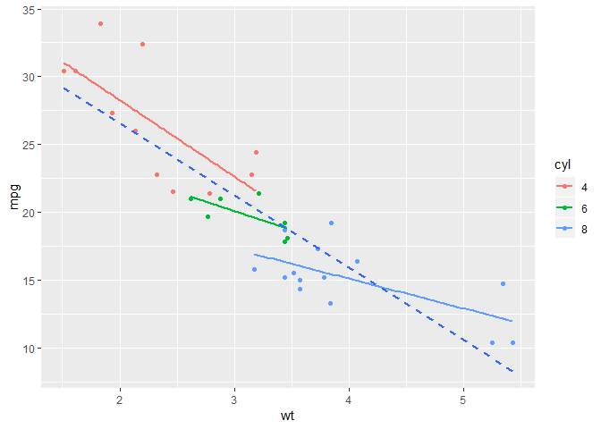<!-- -->

This creates a plot whereby there is a linear model for each cyl, as well as a linear model for the entire dataset, all in a single plot.

In ggplot2, the plotting space is adjusted when adding a second set of points within an additional geom_point() layer. This is due to the object created by ggplot being manipulated.

First imagine what form your data should take in order to form the type of plot you have in your head. Then rearrange your data to form that structure. 

**Data cleaning**

A dataset is considered tidy when every row is an observation and every column is a variable. The tidyr package contains the gather() and separate() functions. Using them to tidy the iris dataset:

```r
head(iris)
```

```
##   Sepal.Length Sepal.Width Petal.Length Petal.Width Species
## 1          5.1         3.5          1.4         0.2  setosa
## 2          4.9         3.0          1.4         0.2  setosa
## 3          4.7         3.2          1.3         0.2  setosa
## 4          4.6         3.1          1.5         0.2  setosa
## 5          5.0         3.6          1.4         0.2  setosa
## 6          5.4         3.9          1.7         0.4  setosa
```

* gather() rearranges the data frame by specifying the columns that are categorical variables with a - notation.
* separate() splits up the new key column, which contains the former headers, according to '.'. The new column names "Part" and "Measure" are given in a character vector.

Creating a new, tidy iris dataset:

```r
iris.tidy <- iris %>%
  gather(key, Value, -Species) %>%
  separate(key, c("Part", "Measure"), "\\.")
head(iris.tidy)
```

```
##   Species  Part Measure Value
## 1  setosa Sepal  Length   5.1
## 2  setosa Sepal  Length   4.9
## 3  setosa Sepal  Length   4.7
## 4  setosa Sepal  Length   4.6
## 5  setosa Sepal  Length   5.0
## 6  setosa Sepal  Length   5.4
```

#Chapter 3 - Aesthetics

Aesthetics refers not to how something looks, but to which variable is mapped onto it. *e.g.* mapping the variable of interest onto color, size, shape, or the x and y axis. These are merely aesthetics onto which the variables are ultimately mapped. Different from simple visual attributes that are called in the geom layer, not the aes layer. Only call aes() within geom layer if using different data sources. Otherwise it is bad form.

**Typical aesthetics**

* x - x axis position
* y - y axis position
* col - colour of dots, outlines of other shapes
* fill - fill colour
* size - diameter of points, thickness of lines
* alpha - transparency
* linetype - dash pattern of line
* label - text on plot or axes
* shape - shape of point

*Label and shape aesthetics can only be mapped to categorical variables

Can specify size and shape arguments among others inside geom_point. These are attributes, not aesthetics. All aesthetics can be used as attributes.

```r
# Draw a scatter plot with color *aesthetic*
ggplot(mtcars, aes(wt, mpg, col = cyl)) + 
  geom_point()
```

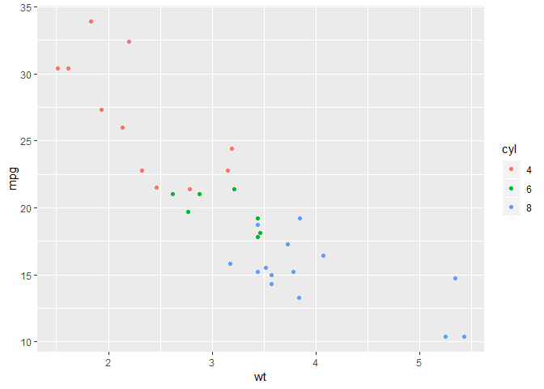<!-- -->

```r
# Same, but set color *attribute* in geom layer 
my_color <- "#4ABEFF"
ggplot(mtcars, aes(wt, mpg, col = cyl)) + 
  geom_point(col = my_color)
```

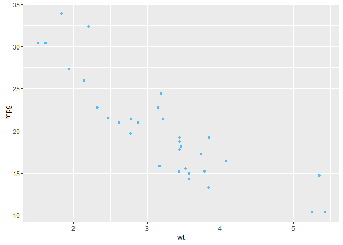<!-- -->

Aesthetics can be used to display more than 2 dimensions of a dataset on a single plot. For this example using mtcars, 5 dimensions.

```r
ggplot(mtcars, aes(mpg, qsec, col = factor(cyl), shape = factor(am), size = (hp/wt))) + geom_point()
```

<!-- -->

**Positions**

Positions specifies how ggplot will handle overlapping points.
Position = "identity" is the default, meaning the points correspond exactly where they should be.
To distinguish many overlapping points, one man use position = "jitter"
Each position type can be accessed as a function, allowing specific arguments to be set (the amount of random noise), and allows it to be stored for use across many plots to maintain consistency.

It is more important to accurately convey the data than look good. A common issue of overly complex plots that confuse the reader. Efficiency in decoding of a visualization means an accurate picture of data as well as conveying the intended message. For example, color is a poor choice for continuous variables and better for discrete/categorical ones. Moreover, color is typically better than shape changes that appear more subtle. One should also avoid redundancy in aesthetic mappings, such as using both shape and color to map the same variable. This adds unnecessary noise, and one should seek to remove all unnecessary visual information from a plot to avoid confusing the reader. Using hollow or transparent shapes can help to address issues of over-plotting before even considering positioning changes.

#Chapter 4 - geometry layer

Affects how the plot looks. 37 Geometries to choose from, accessed via geom_ functions which have their own specific aesthetic mappings, some of which are essential. There are 3 common plots:
* scatter plots
* bar plots
* line plots

**Scatter plot**

Accessed via geom_point(), x and y aesthetic mappings are essential. Other options exist and can also be used as attribute settings within geom_point() itself. Can access another data set by adding it within an additional geom_point layer.

Shapes 21-25 have both fill and color and can be controlled independently.

geom_jitter() is just wrapper for geom_point() with position = "jitter", width argument controls width of the jitter. Moreover, jitter can be a position function "position_jitter()" as in geom_point(position = position_jitter(0.1))

Jittering and alpha blending serve as a good first solution to over-plotting. Moreover, setting shape to only be an outline, such as "shape = 1" can further help, as in the following example:

```r
library(car)
```

```
## Loading required package: carData
```

```r
ggplot(Vocab, aes(education, vocabulary)) + 
  geom_point()
```

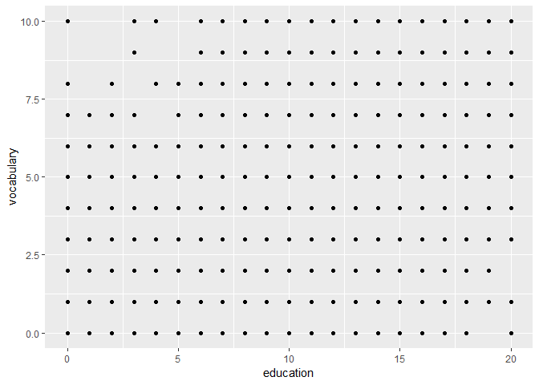<!-- -->

```r
ggplot(Vocab, aes(education, vocabulary)) + 
  geom_jitter()
```

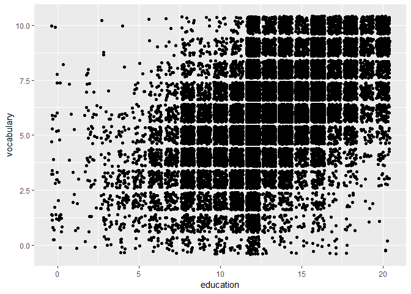<!-- -->

```r
ggplot(Vocab, aes(education, vocabulary)) + 
  geom_jitter(alpha = 0.2, shape = 1)
```

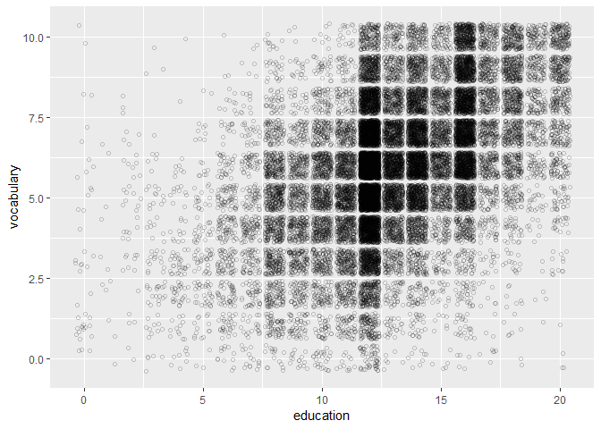<!-- -->


**Bar plot**

Histograms show the bin distribution of a continuous variable. Specify single aesthetic x, and geom_histogram() which can accept arguments

* bindwith - width of the bins (default is range/30)
* position -  "stack",  "dodge" which offsets, "fill" normalizes each bin to represent proportion of all observations in each bin taken by each category. Can be functions, e.g. position_dodge() as with 	jitter. The following examples demonstrate this:

```r
# Draw a bar plot of cyl, filled according to am
ggplot(mtcars, aes(x = cyl, fill = factor(am))) +
  geom_bar()
```

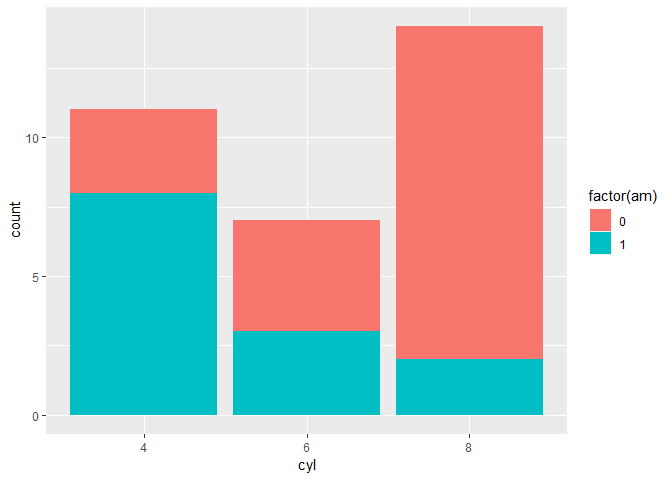<!-- -->

```r
# Change the position argument to stack
ggplot(mtcars, aes(x = cyl, fill = factor(am))) +
  geom_bar(position = "stack")
```

<!-- -->

```r
# Change the position argument to fill
ggplot(mtcars, aes(x = cyl, fill = factor(am))) +
  geom_bar(position = "fill")
```

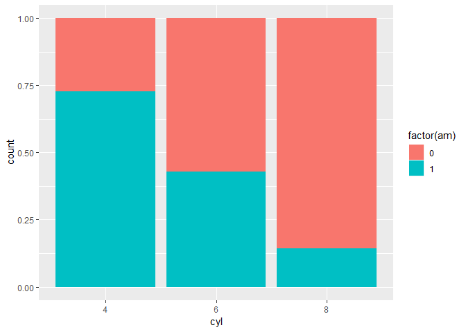<!-- -->

```r
# Change the position argument to dodge
ggplot(mtcars, aes(x = cyl, fill = factor(am))) +
  geom_bar(position = "dodge")
```

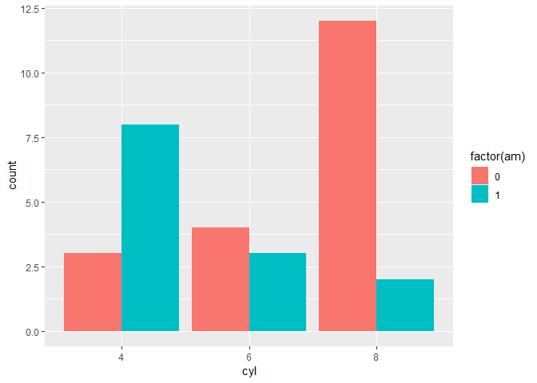<!-- -->

y aesthetic - variable mapped by default called "..count..", the ".." calls the variable count from the internal data frame in which the count of the values in each bin that was calculated with geom_hisogram() executed its default 'stat = "bin"' argument.

Bar plots can depict absolute counts or distributions. geom_bar() arguments:

* position - same as in histogram
* stat - "bin" default, "identity" to plot actual y values

Error bars can be added, *e.g.*:

Geom_errorbar(aes(ymin  = avg -sdev, ymax = avg + stdev), width = 0.2)

Can set the color palette using scale_fill_brewer(). Can see color sets by "?brewer.pal"

**Line Plots**

Series of line segments can be colored individually according to another variable mapped to a color aesthetic. Color is preferable to line type.

Can use geom_area() to fill, by default position = "stack"
Can use geom_rect() to draw rectangles across periods of interest, and needs four aesthetics: xmin, xmax, ymin, ymax. This is seen in the following example using the economics data frame from ggplot2 and a data.frame "recess" containing the beginning and end dates of recessions in columns:

```r
recess <- data.frame("begin" = as.Date(c("1969-12-01", "1973-11-01", "1980-01-01", "1981-07-01", "1990-07-01", "2001-03-01")), "end" = as.Date(c("1970-11-01", "1975-03-01", "1980-07-01", "1982-11-01", "1991-03-01", "2001-11-01")))

ggplot(economics, aes(x = date, y = unemploy/pop)) +
  geom_rect(data = recess,
         aes(xmin = begin, 
             xmax = end, 
             ymin = -Inf, 
             ymax = Inf),
            inherit.aes = FALSE,
            fill = "red", 
            alpha = 0.2
            ) + 
  geom_line()
```

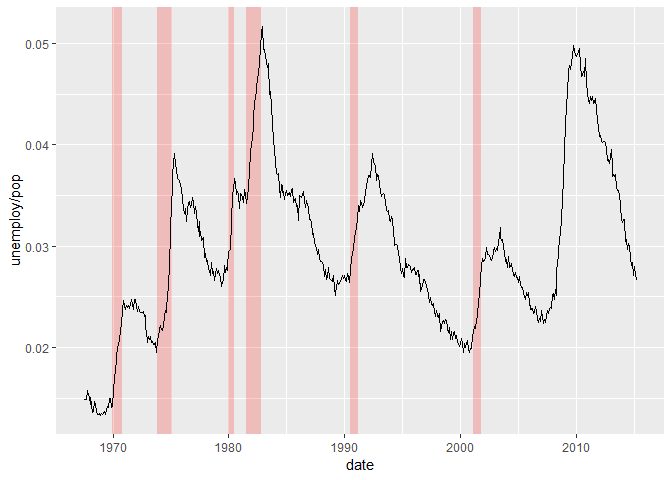<!-- -->


